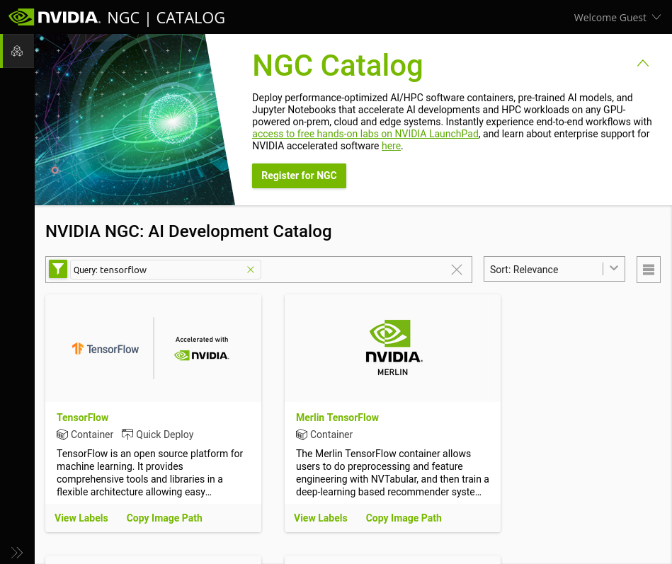
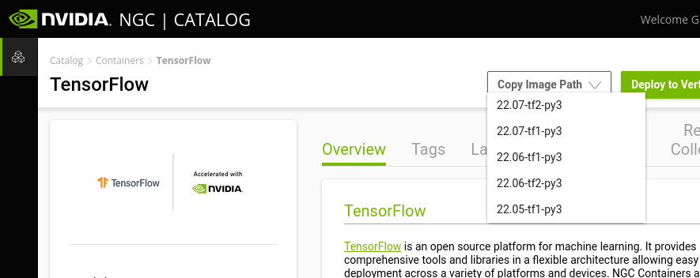

You can download a large range of container images by visiting [NVIDIA GPU Cloud (NGC)](https://catalog.ngc.nvidia.com/) and check whether NVIDIA provides a container image with the application you need.



As an example, this could be TensorFlow. You can search on NGC and find [TensorFlow](https://catalog.ngc.nvidia.com/orgs/nvidia/containers/tensorflow). Here you can choose the desired version from the "Copy image path" dropdown menu:



This copies a link to the container image which we will use in the following example.


We need to use Singularity to download the container image and in order to run Singularity, we must run it through the Slurm queueing system using the command `srun`. 

To download the container image to your directory paste the url to the container image like so:

`srun --mem 40G singularity pull docker://nvcr.io/nvidia/tensorflow:24.03-tf2-py3`

NOTE: The container image could take ~20 minutes to download. 

The above example consists of the following parts:

- `srun`: the Slurm command which gets the following command executed on a compute node.
- `mem`: a Slurm command that allows you allocate memory to your process, in this case 40GB of memory. A higher amount of memory than the default is needed specifically for this TensorFlow container image. Please see the *Work-around for memory-consuming downloads* section at the bottom of the page for a better way to avoid excessive memory requirements.
- `singularity pull`: the Singularity command which downloads a specified container image.
- `docker://nvcr.io/nvidia/tensorflow:24.03-tf2-py3`: this part of the command itself consists of two parts. `docker://` tells Singularity that we are downloading a Docker container image and Singularity
automatically converts this to a Singularity container image upon download. `nvcr.io/nvidia/tensorflow:24.03-tf2-py3` is the container image label copied from the NGC webpage which identifies the particular container image and version that we want.

Once the `singularity pull` command has completed, you should have a file called `tensorflow_24.03-tf2-py3.sif` in your user directory (use the command `ls` to see the files in your current directory).

<hr>

## Work-around for memory-consuming downloads

Downloading some Singularity container images may require a large amount of memory to succeed, such as:

```console
srun singularity pull docker://nvcr.io/nvidia/tensorflow:23.03-tf1-py3
```

If you simply run this command as-is, you are likely to experience an out-of-memory error during build of the container image. A work-around for this issue is to simply allocate more memory to your job using the `--mem` option for `srun` (it could easily require 40-50GB). This may cause your job to have to wait for a long time before it can start. 

There is, however, a better way to run Singularity to avoid the unreasonable memory requirement. Please follow these steps to use the `/tmp` partition of a compute node during build of your container image:

1. Start an interactive job for building your container image:  
```console
srun --pty bash -l
```
(You may add the `--nodelist` parameter to request a particular compute node as usual with `srun`.)

1. Create a temporary directory for yourself to use during build of your container image:  
```console
mkdir /tmp/`whoami`
```
*Take note of the back-tick characters in the above command; this is just to create a directory called `/tmp/username` if your username is `username`. You can call it something else instead, but it is important to create it under `/tmp`.*

1. Run Singularity to build your container image, using your new directory in `/tmp` for temporary data storage:  
```console
SINGULARITY_TMPDIR=/tmp/`whoami` singularity pull docker://nvcr.io/nvidia/tensorflow:23.03-tf1-py3
```
*The `SINGULARITY_TMPDIR` variable should be set to whatever you named your temporary directory in step 2.*

1. After Singularity has finished building, delete your temporary directory:  
```console
rm -r /tmp/`whoami`
```

1. Exit your interactive job:  
```console
exit
```
