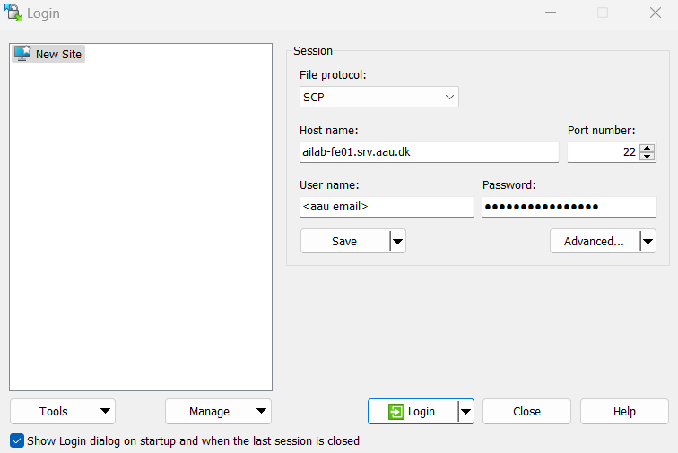

You are now logged into AI-LAB and are in your user directory, which is located at `/ceph/home/<domain>/<user>`. You can confirm this by typing `pwd`. This directory is your private storage space where you can keep all your files. It is stored on a network file system, so you can access your files from any [compute node](../help-and-resources/glossery.md#compute-nodes) within the platform.

Here is the general file structure on AI-LAB:

<div class="tree">
	<ul>
	<li><i class="fa fa-folder-open"></i> /ceph <span>AI-LAB's file system</span>
		<ul>
		<li><i class="fa fa-folder-open"></i> home <span>user home directories</span>
			<ul>
			<li><i class="fa fa-folder-open"></i> [domain] <span>e.g student.aau.dk</span>
				<ul>
				<li><i class="fa fa-folder"></i> [user] <span>your user directory </span>
				</li>
				</ul>
			</li>
			</ul>
		</li>
		<li><i class="fa fa-folder-open"></i> project <span>shared project directories</span>
		</li>
		<li><i class="fa fa-folder-open"></i> course <span>directory with course specific material</span>
		</li>
		<li><i class="fa fa-folder-open"></i> container <span>directory with ready-to-use applications</span>
		</li>
		</ul>
	</li>
	</ul>
</div>

For a detailed overview of the AI-LAB storage system, click [here](../system-overview/storage.md).

<hr>

## Transfer files within AI-LAB
You can use the command `cp [source] [destination]` to copy files and `cp -r [source] [destination]` to copy folders to and from directories within AI-LAB. This will be useful when you need to retrieve applications or course materials later. For example:

```
cp /ceph/course/claaudia/docs/matlab_script.m .
```

Here, `/ceph/course/claaudia/docs/matlab_script.m` is the path to the file or folder you want to copy, and `.` is the path to where you want to copy it—in this case, your user directory.

<hr>

## Transfer files between your local computer and AI-LAB

===+ "Windows"
	You can transfer files between your local computer and AI-LAB using [WinSCP](https://winscp.net/eng/download.php). Other popular solutions are [PuTTY](https://www.putty.org/) and [FileZilla](https://filezilla-project.org/). Alternatively, you can install [OpenSSH](https://learn.microsoft.com/en-us/windows-server/administration/openssh/openssh_install_firstuse?tabs=gui) to use the `scp` command, as shown for [Linux/MacOS](#__tabbed_1_2) users.

	When you open WinSCP, you will be greeted by a *Login* modal. Follow the instructions in the image above to establish a connection to the server.
	
		
	You can now drag and drop files between your local computer and the AI-LAB platform.

	!!! info
		You might want to display hidden files in WinSCP (such as files starting with a dot on Linux systems). Go to Options → Preferences... → Panels and turn on "Show hidden files".

===+ "Linux/MacOS"

	You can transfer files between your local computer and AI-LAB using the command line utility `scp` from your local computer (**note:** You have to be logged out from AI-LAB to use `scp`).

	```console
	scp some-file user@student.aau.dk@ailab-fe01.srv.aau.dk:~/some-dir
	```

	Replace `user@student.aau.dk` with your AAU email address.
	
	Here, `~` represents your user directory on AI-LAB and `/some-dir` a folder in your directory. 

	<hr>

	To copy files from AI-LAB to your local computer, use:


	```console
	scp user@student.aau.dk@ailab-fe01.srv.aau.dk:~/some-folder/some-subfolder/some-file .
	```

	Replace `user@student.aau.dk` with your AAU email address.

	Here, `.` represents the current directory on your local computer.


<hr>

Now that you know the basics of file transfer, lets proceed to learn how to [**get applications :octicons-arrow-right-24:**](getting-applications.md)