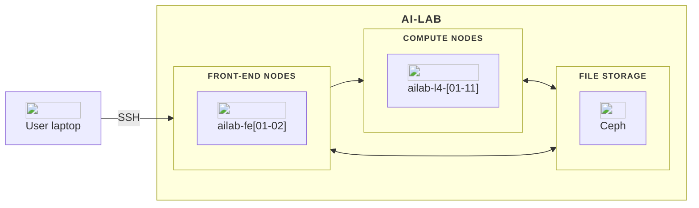

The AI-LAB platform is built around several key components, including two front-end nodes for managing tasks and code, and 11 compute nodes equipped with diverse hardware options.

In this overview, you will find a description of each major component of AI-LAB. Below, is a diagram illustrating the architecture of the AI-LAB platform.

## Front-end nodes
You start by logging into a front-end node, either `ailab-fe01` or `ailab-fe02`. These nodes act as the gateway to the HPC system. Here, you can manage files, write and edit code, and prepare your computational tasks. It is important to note that front-end nodes are not intended for heavy computations; they are optimized for task preparation and interaction with the HPC environment.

## Compute nodes
AI-LAB currently include the following compute nodes:

| Node name            | CPU model             | Number of CPUs | Number of cores | Number of GPUs | GPU Model | Total Memory (GB) |
| -------------------- | --------------------- | -------------- | --------------- | -------------- | --------- | ----------------- |
| ailab-l4-[01-11]     | AMD EPYC 7543 32-Core | 128            | 64              | 8              | NVIDIA L4 | 500               |
